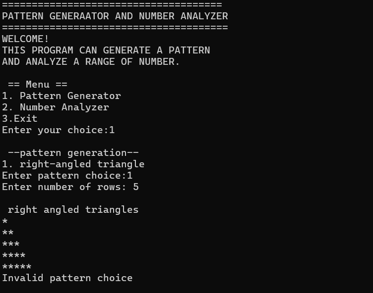

# 🧩 Pattern Generator & Number Analyzer

> 🐍 A beginner-friendly Python console project that combines **pattern generation** and **number analysis** in one simple program.

---

## ✨ Project Overview

**Pattern Generator & Number Analyzer** is a Python-based menu-driven program created to practice fundamental Python concepts such as:

- 🧮 Variables and input
- 🔀 `if-elif-else` statements
- 🔁 `while` and `for` loops
- 🔢 Number calculations
- ⭐ Pattern generation
- ✅ Input validation
- 🧠 Basic program logic

The program provides three main menu choices:

```text
1. Pattern Generator
2. Number Analyzer
3. Exit
```

---

## 🚀 Features

### ⭐ 1. Pattern Generator

The Pattern Generator currently supports a **right-angled triangle** pattern.

Example:

```text
*
**
***
****
*****
```

The user enters the number of rows, and the program generates the pattern using nested `for` loops.

---

### 🔢 2. Number Analyzer

The Number Analyzer allows the user to enter a starting and ending number.

It then:

- 🔍 Checks whether each number is **odd or even**
- ➕ Calculates the **sum of all numbers** in the selected range
- ⚠️ Validates the entered range

Example:

```text
Enter start number: 1
Enter end number: 5

odd and even numbers:
1 is odd
2 is even
3 is odd
4 is even
5 is odd

sum of all numbers: 15
```

---

### 🚪 3. Exit

Selecting option `3` ends the program and displays a thank-you message:

```text
THANK YOU FOR USING PATTERN GENERATOR AND NUMBER ANALAYZER!
PROGRAM ENDED
```

---

## 🛠️ Technologies Used

| Technology | Purpose |
|---|---|
| 🐍 Python | Main programming language |
| 💻 Console / Terminal | Program interface |
| 🔁 Loops | Pattern generation and number analysis |
| 🔀 Conditional Statements | Menu selection and validation |

---

## 📂 Project Structure

```text
project2/
│
├── Logicbox.py
├── screenshot1.png
├── screenshot2.png
└── 2026-09-01 21-08-49.mp4
```

---

## ▶️ How to Run

### 1️⃣ Install Python

Make sure Python is installed on your computer.

### 2️⃣ Open the project folder

Open the folder containing `Logicbox.py`.

### 3️⃣ Run the program

Open a terminal/command prompt in the project folder and run:

```bash
python Logicbox.py
```

---

## 🖼️ Screenshots

### 📸 Screenshot 1



### 📸 Screenshot 2


> 💡 Keep `screenshot1.png` and `screenshot2.png` in the same project/repository folder as this `README.md` so GitHub can display them correctly.

---

## 🎥 Demo Video

The original video is located on the local computer at:

```text
https://drive.google.com/file/d/19QCNjBSD4k1-N4M3D98BW7FmB0ZkV2bn/view?usp=sharing
```

### 📌 GitHub Note

A `C:\Users\...` path works **only on your own computer**. It will not open the video for other people viewing your GitHub repository.

If you later upload the MP4 into the GitHub repository, you can link it from the README using a relative path such as:

```markdown
[🎬 Watch Demo Video](2026-09-01%2021-08-49.mp4)
```

---

## 🧠 Python Concepts Practiced

This project demonstrates several important beginner-level Python concepts:

```text
📌 User Input
📌 Type Conversion
📌 Variables
📌 if / elif / else
📌 while loop
📌 for loop
📌 Nested loops
📌 range()
📌 Modulus operator (%)
📌 Input validation
📌 break
📌 continue
```

---

## 🎯 Learning Objective

The main objective of this project is to understand how different basic Python concepts can be combined to create a **menu-driven application**.

It helps demonstrate how:

```text
User Input
    ↓
Menu Selection
    ↓
Program Logic
    ↓
Pattern / Number Analysis
    ↓
Output
```

---

## 🌟 Future Improvements

Some features that can be added in future versions:

- 🔺 More pattern types
- 🔢 Prime number detection
- 📊 Maximum and minimum number
- 🧮 Average calculation
- 🔄 Better input error handling
- 🎨 More interactive console output

---

## 👩‍💻 Project

**Project Name:** Pattern Generator & Number Analyzer  
**File:** `Logicbox.py`  
**Language:** Python 🐍

---

### ⭐ If you found this project useful, feel free to explore the code and improve it!
